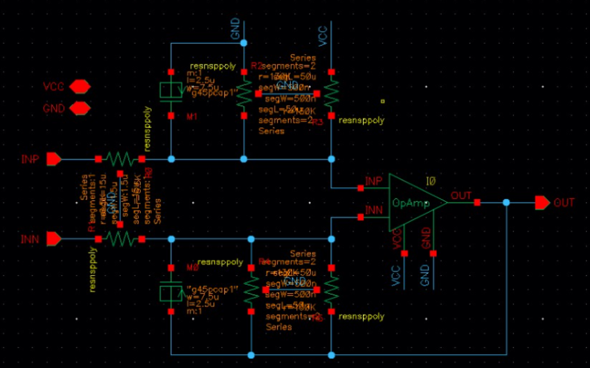
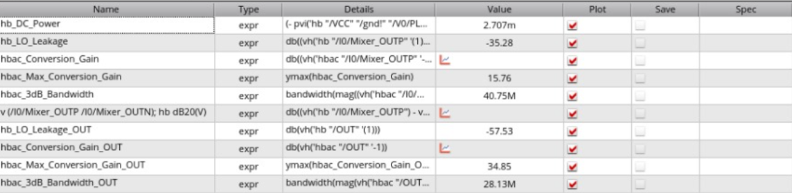
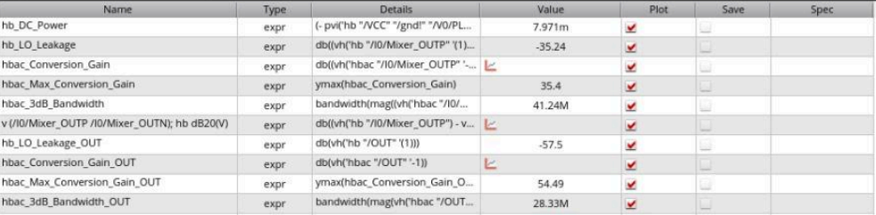

# Baseband Amplifier Design and Receiver IC Integration

RFIC course, Module 4, 2025. Baseband amplifier design around a provided op-amp, then integration with a mixer and LNA, in Cadence Virtuoso / Spectre (gpdk045). Results are schematic-level simulations.

## Scope

- Designed: the baseband amplifier network around the op-amp (resistor and capacitor selection and optimization to meet the gain and bandwidth targets).
- Provided by the course: the op-amp, and the mixer and LNA blocks used for integration. My own LNA is the one in [lna-pcsnim-ble](../lna-pcsnim-ble/).

## Circuit

In a receiver chain the baseband amplifier sits after the mixer, which follows the LNA. It amplifies the downconverted signal to an amplitude that later stages, such as digital conversion, can process.

The amplifier is built around a provided op-amp with negative feedback, with differential inputs (INP, INN) and a single-ended output. The resistors set the gain, the DC bias point and the impedance seen by the mixer. The capacitors set the bandwidth.

## Design targets

| Metric | Target |
|---|---|
| Conversion gain | 30 to 35 dB |
| Bandwidth | 25 to 30 MHz |

Both targets are checked on the mixer plus baseband amplifier configuration. The integrated chain with the LNA exceeds the gain range because the LNA adds gain.

## Component values

| Component | Value | Rationale |
|---|---|---|
| R0, R1 | 6.5 kΩ | Matched to the single balanced mixer to maximize signal transfer |
| R2 to R5 | 130 kΩ | Set so the amplifier supplies the gain still missing after the preceding stage (the report cites a 10 to 15 dB shortfall against the target) |
| M1, M2 capacitors | 265.688 fF | Found by iterative optimization: values were simulated repeatedly until the bandwidth target was met while keeping the gain |

## Simulations

- dcOp: DC operating point, needed for the AC and transient analyses
- hbac: harmonic balance AC, used to measure gain and bandwidth
- tran: transient, used to check the output waveform for distortion

## Results

| Metric | Mixer + baseband amp | Mixer + baseband amp + LNA |
|---|---|---|
| Conversion gain at baseband output | 34.85 dB | 54.49 dB |
| 3 dB bandwidth at baseband output | 28.13 MHz | 28.33 MHz |
| DC power | 2.707 mW | 7.971 mW |
| Conversion gain at mixer output | 15.76 dB | 35.40 dB |
| 3 dB bandwidth at mixer output | 40.75 MHz | 41.24 MHz |

With the mixer and baseband amplifier, gain and bandwidth at the output meet the targets. Adding the LNA raises the gain above the 30 to 35 dB range, as expected, while the output bandwidth stays within target.

## Figures

*Figure 1. Baseband amplifier schematic.*

*Figure 2. Simulation results with the mixer and baseband amplifier.*

*Figure 3. Simulation results after adding the LNA.*

## Analysis

1. **Loading effect.** Connecting the baseband amplifier loads the mixer output. The changed load shifts the mixer's frequency response: the mixer-side 3 dB bandwidth rose from 26.99 MHz to 40.75 MHz, and the mixer-side conversion gain also changed.
2. **Power.** DC power increases as blocks are added: 2.707 mW for the mixer and baseband amplifier, and 7.971 mW after adding the LNA, about 5.3 mW more.
3. **Gain.** The LNA adds about 19.6 dB of conversion gain (34.85 dB to 54.49 dB), because it amplifies the weak signal ahead of the mixer. The output bandwidth stays within target (28.13 MHz to 28.33 MHz).

## Not included

Cadence libraries and provided block designs.
