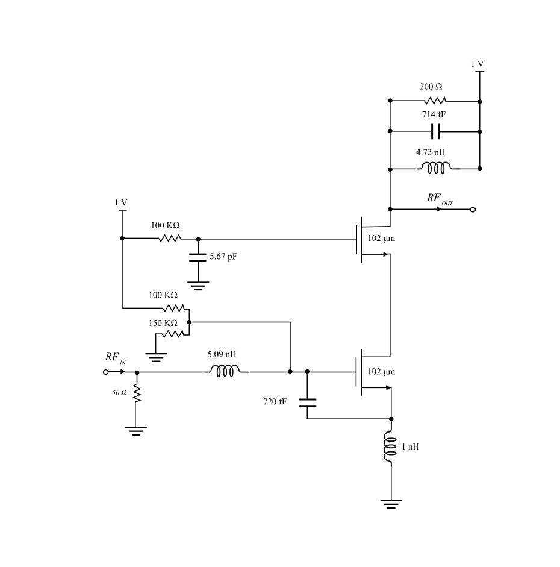
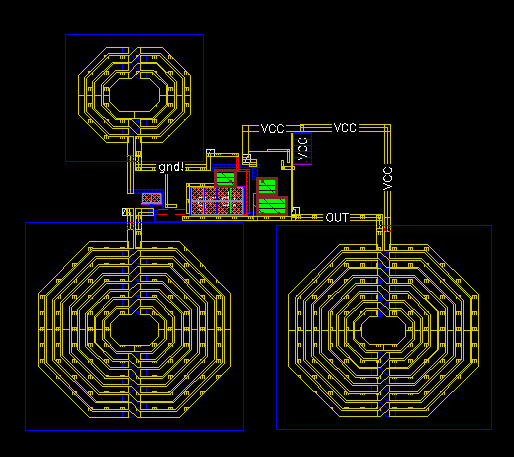
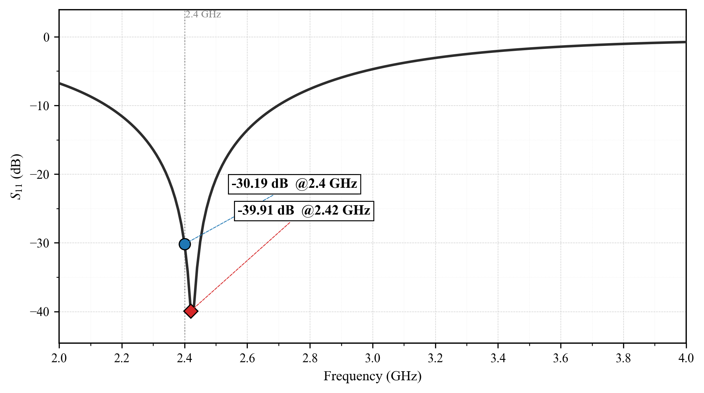
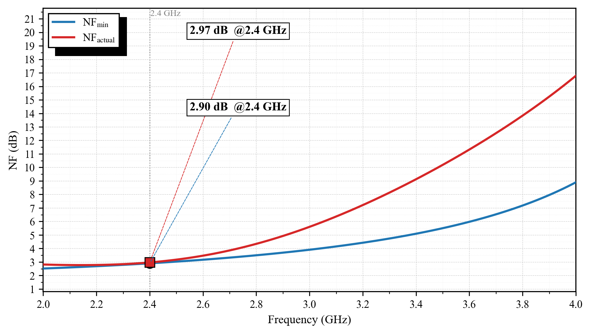
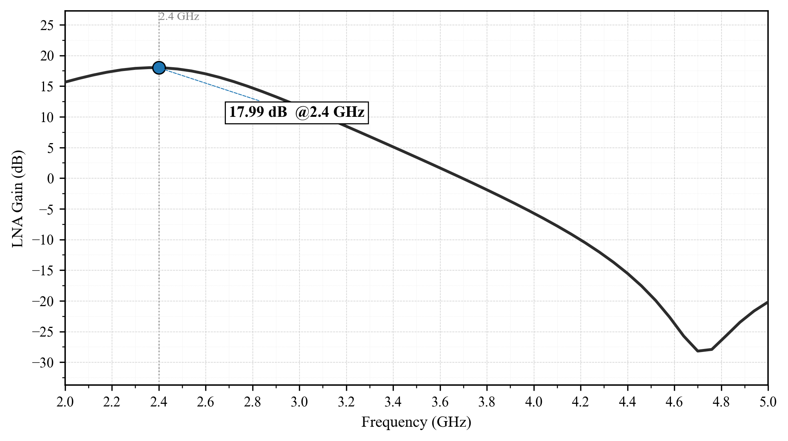

# Low-Power 45 nm CMOS LNA for 2.4 GHz BLE Receivers (PCSNIM)

Undergraduate thesis, Universitas Gadjah Mada. Own design, from schematic to post-layout extraction.

## Overview

A low-noise amplifier for the front end of a 2.4 GHz Bluetooth Low Energy receiver, using the PCSNIM technique (power-constrained simultaneous noise and input matching) with inductive source degeneration and a cascode stage. Target specifications were derived from the Bluetooth Core Specification 6.0 [3].

Topology progression studied in the thesis: common-source, inductively degenerated common-source, SNIM, then PCSNIM [1], [2].

## Tools and flow

- Schematic and layout: Cadence Virtuoso
- Simulation: Spectre
- DRC / LVS: Pegasus
- Parasitic extraction: Quantus (post-layout results below)
- PDK: gpdk045

## Final design point

| Parameter | Value |
|---|---|
| Supply voltage Vdd | 1 V |
| Bias voltage Vgs (M1) | 0.6 V (100 kΩ / 150 kΩ divider from 1 V) |
| Cascode gate bias (M2) | 1 V through 100 kΩ, 5.67 pF decoupling |
| Transistor width (M1, M2) | 102 µm each (34 fingers × 3 µm) |
| Drain current | 2.1 mA |
| Load resistor Rd | 200 Ω (in parallel with Ld and Cd) |
| Source inductor Ls | 1 nH |
| Gate inductor Lg | 5.09 nH |
| External Capacitor Cex | 720 fF |
| Drain inductor Ld | 4.73 nH |
| Drain capacitor Cd | 714 fF |
| Channel length L | 45 nm |

## Results (post-layout)

| Metric | Target | Post-layout result |
|---|---|---|
| Noise figure | <5 dB | 2.97 dB |
| S11 | ≤ −20 dB | −30.19 dB |
| Voltage gain | 15–20 dB | 17.99 dB |
| Power consumption | ≤ 2.5 mW | 2.1 mW |
| IIP3 (supplementary) | ≥ −10 dBm (not a primary spec) | −12.36 dBm (did not meet its target) |
| Chip area | n/a | 0.113 mm² (including the inductors) |

All results are at 2.4 GHz with a 50 Ω source impedance. Gain is the voltage gain into a 5 kΩ load (the mixer input), not S21. The final layout passes Pegasus DRC and LVS.

NF, S11, gain and power all meet their targets. IIP3 was treated as a supplementary metric next to these, and the post-layout result of −12.36 dBm missed the target set for it.

## Figures

*Figure 1. LNA schematic (redrawn) with final component values.*

*Figure 2. LNA layout (0.113 mm², including the inductors).*

*Figure 3. Post-layout S11 (−30.19 dB at 2.4 GHz).*

*Figure 4. Post-layout noise figure (2.97 dB at 2.4 GHz).*

*Figure 5. Post-layout voltage gain into a 5 kΩ load (17.99 dB at 2.4 GHz).*

## Design decisions and trade-offs

1. **Why PCSNIM.** PCSNIM adds Cex as an extra degree of freedom. The transistor can be sized small for low power and low noise, while Cex restores the capacitance needed for input matching, easing the noise-matching trade-off of SNIM [1]. The larger total capacitance also lowers the required Lg (5.09 nH here). The cost is extra area from Cex and a resonance that is more sensitive to its value.
2. **Lg cap and inductor area.** Lg is capped at 10 nH. It sits directly in the input path, so its series resistance adds noise at the first stage, and larger on-chip inductors have lower Q. The non-ideality analysis (in the thesis) showed Lg is the dominant source of degradation, so the final design uses 5.09 nH. Inductors also occupy a large share of the silicon area, so every extra nH costs area as well as Q. This is why Cex is preferred over a larger Lg.
3. **Bias selection.** In a Vgs sweep of the transistor at 2.4 GHz, NFmin is lowest at Vgs = 0.7 V (0.168 dB) and rises again at higher bias. At Vgs = 0.6 V, NFmin is 0.196 dB, only 0.028 dB higher, while the drain current is about 37% of the current at the optimum. Biasing higher therefore costs power for almost no noise benefit, so Vgs is set to 0.6 V. The final 102 µm device (34 fingers × 3 µm) draws 2.1 mA (2.1 mW) at this bias.
4. **Layout parasitics.** After the first post-layout simulation, the contribution of each parasitic type was isolated by repeating the extraction with no parasitics, R only, C only and R+C. Resistance dominated the NF increase (+0.5 dB for R only vs. +0.1 dB for C only, relative to the extraction without parasitics). NF stayed within 0.1 dB of the circuit's NFmin in every case, so the added noise comes from resistive loss rather than a noise mismatch. The R-only run also shifted the input reactance by about −5 Ω and degraded S11 from −28 dB to −21 dB, while the C-only run shifted it by about +4 Ω and did not degrade S11. In the combined R+C run these shifts largely offset each other (S11 −29 dB). Gain was already about 1 dB lower in the extraction without parasitics than in the schematic (19 to 18 dB) and did not change further with R or C, so at the resolution of this study the gain drop is not attributable to R or C parasitics. The layout was then improved and the design re-simulated. For the final design, post-layout extraction shifted the schematic results (NF 2.45 dB, S11 −35.09 dB, gain 19.54 dB) to NF 2.97 dB, S11 −30.19 dB and gain 17.99 dB, all within target.
5. **Cascode.** M2 is stacked on M1 to isolate the input from the output, so the input match does not shift easily with the output tank. Without it, Cgd of M1 feeds the drain back to the gate, and the Miller effect multiplies it by the stage gain. That changes the effective input capacitance, and with it the resonance and Re(Zin). With M2, the drain of M1 sees roughly 1/gm2, so the gain of M1 is close to unity and this effect is small. The cost is voltage headroom at a 1 V supply.

   ## Limitations and next steps

- The design was not taped out, so there are no measurement results.

## References

1. K. Nguyen, C.-H. Kim, G.-J. Ihm, M.-S. Yang, and S.-G. Lee, "CMOS low-noise amplifier design optimization techniques," *IEEE Trans. Microw. Theory Techn.*, vol. 52, no. 5, pp. 1433–1442, May 2004.
2. B. Razavi, *RF Microelectronics*, 2nd ed. Prentice Hall, 2011.
3. Bluetooth SIG, *Bluetooth Core Specification*, Version 6.0, 2024.

## Not included

Cadence libraries, technology files and raw layout databases. Design was done with gpdk045.
