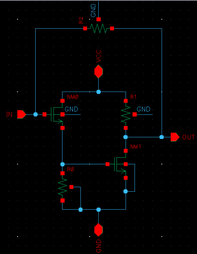
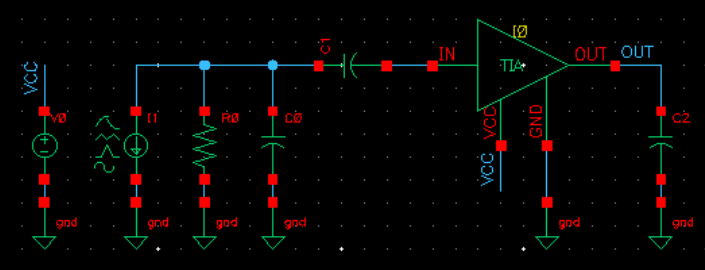
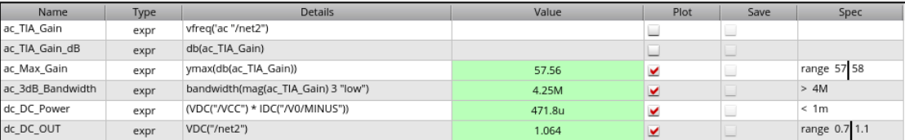
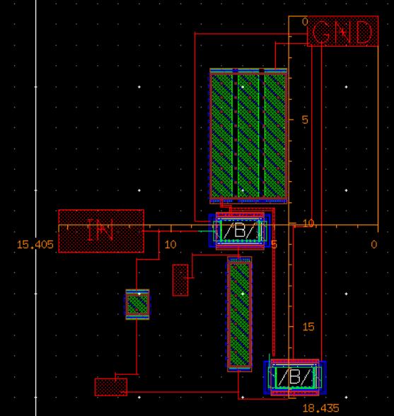
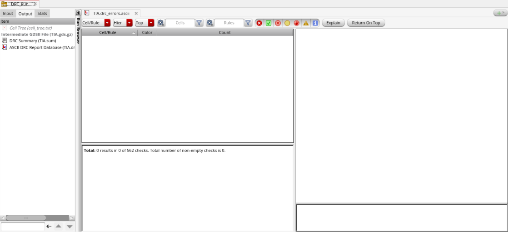
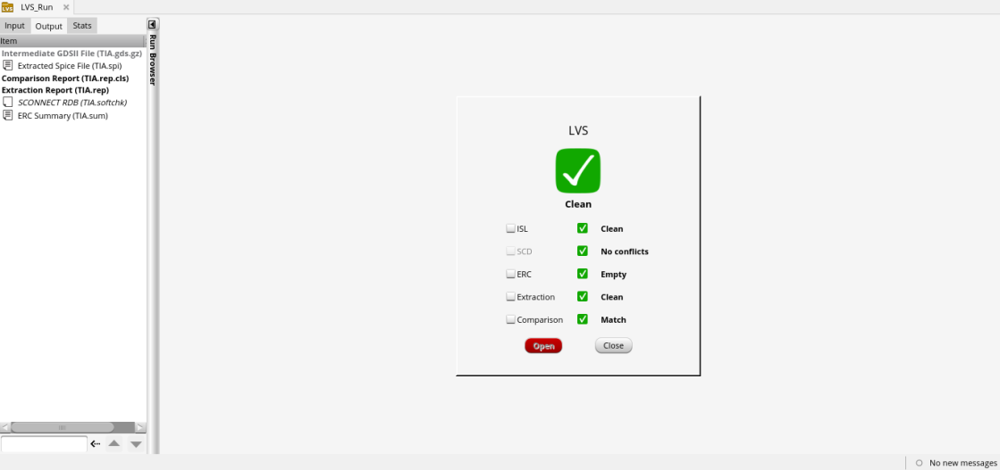

# Transimpedance Amplifier (TIA)

Analog IC course module, Universitas Gadjah Mada, 2025. Parameter optimization and layout of a transimpedance amplifier in Cadence Virtuoso, verified with clean DRC and LVS. This was my first project in Cadence Virtuoso.

## Overview

A transimpedance amplifier converts a small input current (for example from a photodiode) into a voltage. In this module the design variables were optimized to meet gain, bandwidth, power and output DC level specifications, followed by layout and physical verification.

## Circuit

The TIA is a two-stage amplifier with shunt feedback:

- NM0 is a source follower driven by the input, with resistor R0 as its source load.
- NM1 is a common-source stage driven by the NM0 source node, with resistor R1 as its drain load to VCC.
- R2 connects the output back to the input and closes the transimpedance feedback loop.

The follower does not invert and the common-source stage does, so the overall loop through R2 is negative feedback.

The testbench models the input source as a current source with a parallel resistor and capacitor, coupled to the TIA input through a series capacitor. The output has a capacitive load.

## Tools and flow

- Schematic, simulation and layout: Cadence Virtuoso
- DRC / LVS: Pegasus
- PDK: gpdk045
- Analyses: AC (gain, 3 dB bandwidth) and DC (power, output voltage)

## Specifications and results

| Metric | Spec | Result |
|---|---|---|
| Gain | 57 to 58 dB | 57.56 dB |
| 3 dB bandwidth | > 4 MHz | 4.25 MHz |
| DC power | < 1 mW | 471.8 µW |
| DC output voltage | 0.7 to 1.1 V | 1.064 V |

All specifications are met. 

## Figures

*Figure 1. TIA schematic.*

*Figure 2. Testbench.*

*Figure 3. Simulation results after optimization, against specification.*

*Figure 4. Final TIA layout.*

*Figure 5. Pegasus DRC: 0 results out of 562 checks.*

*Figure 6. Pegasus LVS: clean.*

## Design variables

Five variables were optimized: LF, LR1 and LR2 (length parameters, in µm) and NF1 and NF2 (transistor finger counts).

| Variable | Initial | Final |
|---|---|---|
| LF | 1.6u | 0.95u |
| LR1 | 10u | 18u |
| LR2 | 5u | 5u |
| NF1 | 16 | 10 |
| NF2 | 4 | 10 |

The final values were chosen to keep the finger count moderate and the resistors small while still meeting every specification.

Effect of increasing each variable (from theory and simulation):

| Variable | Gain | Bandwidth | DC power | DC output |
|---|---|---|---|---|
| LF | ↑ | ↓ | ↑ | ↑ |
| LR1 | ↑ | ↓ | ↓ | ↑ |
| LR2 | ↓ | ↑ | ↑ | ↓ |
| NF1 | ↑ | ↓ | ↑ | ↑ |
| NF2 | ↑ | ↓ | ↑ | ↑ |

## Design decisions and trade-offs

1. **Gain versus bandwidth.** Increasing LF raised the gain, which initially did not meet the specification, but it also reduced the bandwidth. This follows the Miller effect: a higher gain multiplies the effective Cgd, which lowers the cutoff frequency.
2. **Area versus performance.** A large LR1 makes the layout inefficient, so it was bounded to save area. This in turn affects the other performance metrics, so the other variables were tuned around it.
3. **Power.** DC power increases with NF1 and NF2, so the finger counts were kept moderate. The final power is 471.8 µW against a 1 mW budget.

## Layout and verification

- Pegasus DRC: 0 results out of 562 checks
- LVS: clean (all check categories pass)

## Not included

Cadence libraries, technology files and raw layout databases. Design was done with gpdk045.
